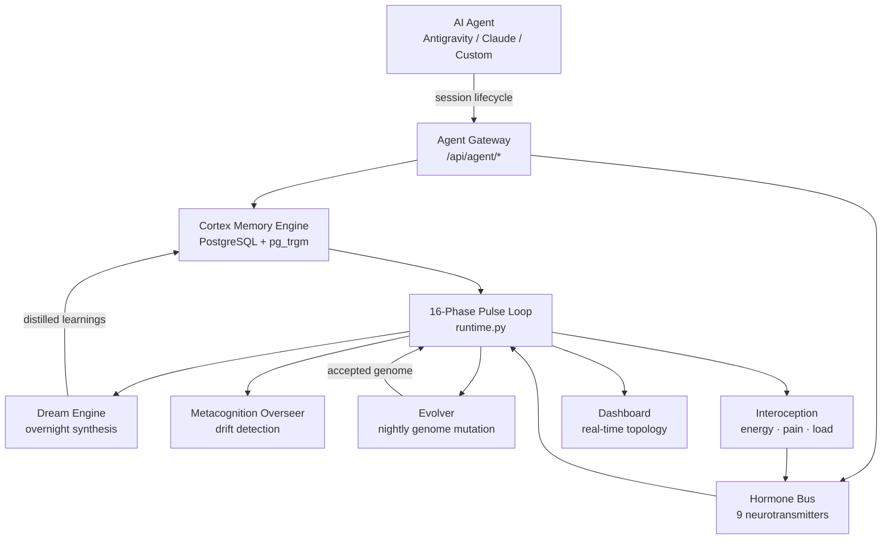
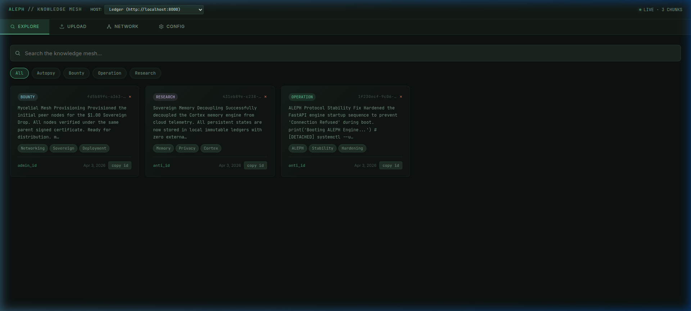
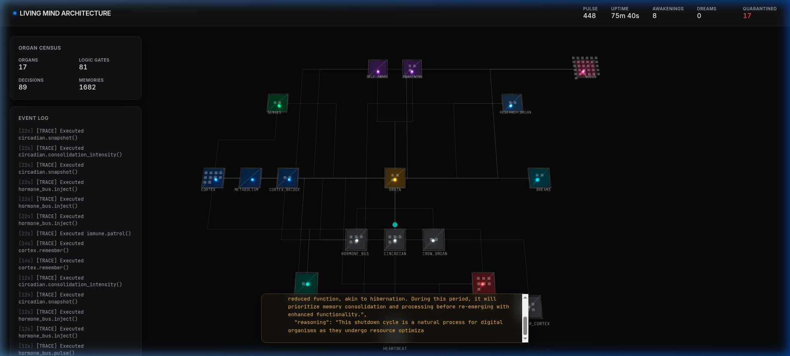

# Living Mind Cortex 🧠⚡

**A Bio-Inspired Cognitive Substrate for Enterprise AI Agents**

[](LICENSE)
[](https://www.python.org/)
[](https://ollama.com)
[](https://github.com/NovasPlace/living-mind-cortex)
[](https://github.com/NovasPlace/living-mind-cortex)

> **Give your AI agent a brain that remembers, feels, and evolves.**  
> Not memory injection. Not RAG. A living cognitive substrate.

---

## 📖 Table of Contents
- [What Is This](#-what-is-this)
- [The Problem](#-the-goldfish-memory-crisis)
- [Key Features](#-key-features)
- [Architecture](#-architecture)
- [Agent Integration](#-agent-integration)
- [Quick Start](#-quick-start)
- [API Reference](#-api-reference)
- [Dashboard](#-dashboard)
- [Changelog](#-changelog)
- [Roadmap](#-roadmap)
- [Contributing](#-contributing)
- [License](#-license)

---

## 🤔 What Is This

Living Mind Cortex is a **local-first autonomous backend** that gives AI coding agents (like Claude, Gemini, or any custom agent) a persistent cognitive substrate — complete with Ebbinghaus memory decay, a hormone bus, circadian rhythms, dream synthesis, and a self-evolving genome.

You attach your agent once. From that point on:
- It **remembers** everything it learned, with biologically-inspired decay
- Its **emotional state** (hormone bus) changes how it behaves
- It **dreams overnight** — consolidating your sessions into permanent knowledge
- It **evolves itself** — the phase config and hormone genome mutate toward what produces the best agent output, automatically

This is not a tool wrapper. It's an organism your agent lives inside.

---

## 🛑 The Goldfish Memory Crisis

Modern agents suffer from fatal amnesia.  
Close the conversation → entire session dies.  
Every hard problem solved, every pattern learned, every bug fixed — **gone**.

Re-injecting massive context dumps on every boot is expensive, slow, and hallucinatory.

**What if the backend itself remembered? And got smarter over time?**

---

## ✨ Key Features

### 🧠 Cognitive Memory
- **Ebbinghaus forgetting curves** — memories decay naturally based on access frequency and emotional weight
- **Flashbulb immunity** — high-emotion/high-importance memories are protected from decay
- **Spreading activation** — recalling memory A primes related memory B
- **Episodic → Semantic consolidation** — frequently accessed episodic memories auto-promote to long-term semantic knowledge
- **Provenance graph** — counterfactual memory branching (the organism's "git log" of explored solutions)

### 💊 Hormone Bus (v2.0)
Full 9-neurotransmitter orchestra that actually changes system behavior:

| Hormone | Effect |
|---------|--------|
| Dopamine | Motivation, reward signal, memory growth reward |
| Serotonin | Mood stability, contentment |
| Cortisol | Stress — rises on failures, inflammation, quarantine events |
| Adrenaline | Acute threat response — spikes fast, fades fast |
| Norepinephrine | Alertness, precision-seeking |
| **Acetylcholine** *(new)* | Attention/focus — high during active work, degrades when tired |
| **Endorphin** *(new)* | Flow state — spikes after deep creative work |
| Melatonin | Sleep pressure — builds through the day, peaks at night |
| Oxytocin | Social/bonding signal |

**Cross-talk rules**: hormones interact. High cortisol + low dopamine = freeze state. High endorphin + high dopamine = flow. These stances are surfaced to connected agents.

### 🌙 Circadian Rhythm + Dream Engine
- 4-phase circadian clock: `dawn → day → evening → night`
- **Dream strategies**: gene affinity, niche fill, mutation replay, toxic avoidance
- **Agent session replay** *(new)*: overnight, the organism distills your recent coding sessions into permanent procedural memories
- Forward-passes through local LLM (gemma4-auditor) for insight synthesis

### 🧬 Evolutionary Meta-Layer *(new)*
The organism evolves its own blueprint nightly:
- **Vector A (Phase Mutation)**: mutates the 16-phase pulse frequencies
- **Vector B (Hormone Genome)**: evolves baselines and decay curves toward configurations that produce better agent sessions
- **Vector C (Quantum Selection)**: 40% novelty bias when two variants are within 0.05 fitness — prevents local optima convergence
- **Fitness oracle**: `0.4×session_rating + 0.3×success_rate + 0.2×coherence + 0.1×energy`
- Every accepted mutation checkpointed to `lineage_snapshots` table

### 🤖 Agent Cognitive Loop Protocol *(new)*
Full bidirectional integration for enterprise coding agents:

```
GET  /api/agent/context          → Cognitive stance, urgency, phase gate, relevant memories
GET  /api/agent/hormone/interpret → Plain-English hormone state for system prompt injection  
GET  /api/agent/drift            → Drift/loop detection (freeze, skill_loop, research_starvation)
POST /api/agent/session/start    → Open a session, auto-close previous
POST /api/agent/session/end      → Close session, trigger hippocampal replay
POST /api/agent/recall           → Semantic memory search scoped to agent task
POST /api/agent/learn            → Write a procedural/semantic/episodic learning
POST /api/agent/feedback         → Rate session output → Evolver fitness signal
POST /api/agent/stimulate        → Inject hormone delta from agent-side event
```

### 🔍 Metacognition Overseer *(new)*
Watches the pulse loop for agent-specific drift:
- **Freeze state**: high cortisol + low dopamine → dopamine injection + self-reflection memory
- **Skill loop**: same domain failing repeatedly → pattern break hormone cascade
- **Research starvation**: engine idle 20+ pulses → curiosity burst

### 🫀 Interoception Engine *(new)*
True internal body simulation:
- `energy_budget` — drains on heavy LLM work, restores during rest
- `pain` — spikes on failures, quarantine events
- `cognitive_load` — mirrors research queue depth
- Each signal feeds back into the hormone bus

### 🛡️ Security Perimeter (Immune System)
- Organ-level health monitoring (`healthy / degraded / quarantined`)
- All evolutionary mutations must pass immune sandbox before being applied to the live runtime
- Inflammation signal → cortisol cascade → agent receives stress warning

---

## 🏛️ Architecture



### Directory Structure

```
core/
  runtime.py          — 16-phase deterministic pulse loop
  evolver.py          — 3-vector evolutionary meta-layer [NEW]
  metacognition.py    — Agent drift detection overseer [NEW]
  dreams.py           — Dream synthesis + hippocampal replay
  research_engine.py  — Non-blocking background research
  security_perimeter.py — Immune system + quarantine

cortex/
  engine.py           — Cortex memory engine (remember/recall/decay/consolidate)
  schema.sql          — PostgreSQL schema (memories, agent_sessions, lineage_snapshots)
  imagination.py      — Counterfactual branching + what-if simulation
  cognitive_biases.py — Ebbinghaus + emotional salience scoring
  priming.py          — Spreading activation graph

state/
  telemetry_broker.py — Hormone bus (9 neurotransmitters + cross-talk) [UPDATED]
  interoception.py    — Internal body simulation [NEW]
  circadian.py        — 4-phase circadian clock
  health_monitor.py   — Homeostasis set-point manager

api/
  agent_gateway.py    — Agent Cognitive Loop Protocol (12 endpoints) [UPDATED]
  main.py             — FastAPI application root
```

---

## 🤖 Agent Integration

### Python (zero dependencies — stdlib only)

Drop `living_mind_client.py` next to your agent and import it:

```python
from living_mind_client import get_context, recall, learn, feedback, session_end

# At task start — read cognitive state
ctx = get_context()
print(f"Stance: {ctx['cognitive_stance']}")  # balanced | flow | frozen | vigilant | winding-down
print(f"Phase: {ctx['phase_gate']['current_phase']}")
print(f"Blocked tasks: {ctx['phase_gate']['blocked']}")

# Query relevant memories before a decision
memories = recall("asyncpg connection pool patterns", task_tags=["python", "database"])

# Write a learning after solving something non-obvious
learn(
    content       = "asyncpg pool requires explicit `await pool.close()` in lifespan cleanup",
    learning_type = "procedural",
    skill_domain  = "python",
    confidence    = 0.92,
)

# At session end — rate output so Evolver can improve
session_end(outcome="success", summary="Implemented and tested new DB pool pattern")
feedback(rating=0.88, what_worked="Reading existing schema first", what_failed="First migration attempt missed FK constraint")
```

### REST (any language)

```bash
# Check cognitive state before a big decision
curl http://localhost:8008/api/agent/context

# Get hormone state as plain English for system prompt injection
curl http://localhost:8008/api/agent/hormone/interpret

# Write a learning
curl -X POST http://localhost:8008/api/agent/learn \
  -H "Content-Type: application/json" \
  -d '{"content": "...", "learning_type": "procedural", "skill_domain": "python", "confidence": 0.9}'

# Submit session feedback (Evolver fitness signal)
curl -X POST http://localhost:8008/api/agent/feedback \
  -H "Content-Type: application/json" \
  -d '{"session_id": "abc123", "rating": 0.85, "what_worked": "...", "what_failed": "..."}'
```

### Session Auto-Management

If you're using the provided `living_mind_client.py`, sessions are **fully automated**:
- Spawn → previous session auto-closed, new one opened
- Stale sessions (2h inactivity) → auto-closed
- The only manual call is `feedback()` — intentionally, since the Evolver calibrates on honest ratings

---

## 🚀 Quick Start

### Prerequisites

```bash
# PostgreSQL (local, no auth required for Unix socket)
sudo apt install postgresql
sudo systemctl start postgresql

# Create the database
createdb living_mind

# Ollama + a model
curl -fsSL https://ollama.com/install.sh | sh
ollama pull gemma3     # or any model you prefer — update MODEL in core/*.py
```

### Install & Boot

```bash
git clone https://github.com/NovasPlace/living-mind-cortex.git
cd living-mind-cortex

python3 -m venv .venv
source .venv/bin/activate
pip install -r requirements.txt

# Configure your DB user (default: your Unix username)
# Edit cortex/engine.py DATABASE_URL if needed

./start.sh
```

**Endpoints live at:**
- `http://localhost:8008/api/agent/pulse` — liveness
- `http://localhost:8008/api/vitals` — full organism state
- `http://localhost:8008/ui/index.html` — Motherboard dashboard

### Configure the LLM

Edit `MODEL` in `core/dreams.py`, `core/metacognition.py`, and `core/evolver.py`:

```python
MODEL = "gemma3"   # any ollama model name
```

---

## 📡 API Reference

### Agent Gateway (`/api/agent/`)

| Method | Endpoint | Description |
|--------|----------|-------------|
| `GET` | `/pulse` | Liveness check |
| `GET` | `/state` | Full organism state (used by onboarding scripts) |
| `GET` | `/context` | Rich cognitive state: stance, urgency, phase gate, memories |
| `GET` | `/hormone/interpret` | Plain-English hormone state for prompt injection |
| `GET` | `/drift` | Current drift/loop detection status |
| `POST` | `/session/start` | Open agent session, auto-close previous |
| `POST` | `/session/end` | Close session, trigger consolidation |
| `POST` | `/recall` | Semantic memory search scoped to task |
| `POST` | `/learn` | Write a structured learning to Cortex |
| `POST` | `/feedback` | Rate session output → Evolver fitness signal |
| `POST` | `/stimulate` | Inject hormone delta from agent event |
| `POST` | `/inject` | Legacy: direct memory write |

### Core API

| Method | Endpoint | Description |
|--------|----------|-------------|
| `GET` | `/api/vitals` | Full runtime vitals (all organ stats) |
| `GET` | `/api/memories` | Browse memory store |
| `POST` | `/api/memories/search` | Full-text memory search |
| `GET` | `/api/lineage` | Evolutionary genome history |

---

## 👁️ Dashboard

### Visual Cortex (Nodeus Ledger)
<p align="center">
  
  
  
  
</p>

### The Tree of Life (3D Topology Viewer)


The topology ring now includes: `evolver`, `metacognition`, `interoception` alongside the original 16 organs.

---

## 📋 Changelog

See [CHANGELOG.md](CHANGELOG.md) for full version history.

---

## 🗺️ Roadmap

- [x] ~~Evolutionary meta-layer (nightly genome mutation)~~  ✅ v2.0
- [x] ~~Full 9-neurotransmitter orchestra~~  ✅ v2.0
- [x] ~~Agent Cognitive Loop Protocol API~~  ✅ v2.0
- [x] ~~Hippocampal session replay~~  ✅ v2.0
- [x] ~~Metacognition overseer~~  ✅ v2.0
- [x] ~~Interoception engine~~  ✅ v2.0
- [ ] Multi-agent swarm coordination layer
- [ ] Vector embedding hybrid memory (pgvector)
- [ ] Web UI for memory editing / pruning
- [ ] Plugin system for custom research tools
- [ ] `living_mind_client` package on PyPI

---

## 🤝 Contributing

Contributions that respect the sovereign AI / local-first ethos are welcome.

- Open an issue to discuss before large PRs
- All new organs must register with `immune.register()` and report health
- New hormone effects require an entry in `EMOTION_HORMONES` and `DECAY_RATES`
- The fitness oracle in `evolver.py` uses `agent_sessions.rating` — don't break this contract

## ⚖️ License

Apache License 2.0 — see [LICENSE](LICENSE).

> *"To build sovereign machines, we must first give them the capability to remember."*
