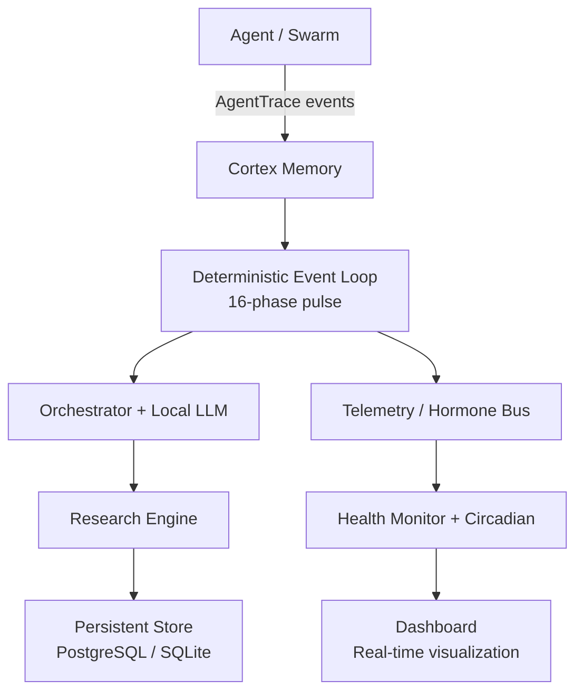

# Living Mind Cortex 🧠⚡

**The Sovereign Backend for Autonomous Agents**

[](LICENSE)
[](https://www.python.org/)
[](https://ollama.com)
[](https://github.com/NovasPlace/living-mind-cortex)

> **Cognitive Continuity for AI agents.**  
> Never lose a thought again.

---

## 🛑 The Goldfish Memory Crisis

Modern agents suffer from fatal amnesia.  
Close the terminal → entire session dies.  
Every hard problem solved, every pattern learned, every bug fixed — **gone**.

Re-injecting massive context dumps on every boot is expensive, slow, and hallucinatory.

## ⚡ The Solution: Living Mind Cortex

**Living Mind Cortex** is a fully autonomous, **local-first** memory backend and deterministic event loop built explicitly for AI agents and swarms.

Attach your agent once and it instantly gains:

*   **Cognitive Continuity** — wakes up with full memory of every previous "life".
*   **Autonomous Background Synthesis** — while your agent sleeps, the Cortex thinks, researches, and reorganizes memories using local LLMs.
*   **Zero-Trust Sovereignty** — 100% offline. No API keys. No telemetry. No cloud lock-in.

---

## ✨ Key Features

*   16-phase **Deterministic Event Loop** (never blocks on external calls).
*   Persistent + decaying **working memory** inspired by human cognition.
*   Self-directed research engine (DDG + Ollama) that runs in the background.
*   Emotional hormone bus (`Cortisol`, `Dopamine`, etc.) that actually changes behavior.
*   Circadian sleep/wake cycles with "Dream" states for overnight synthesis.
*   Beautiful real-time Svelte dashboard.

---

## 🏛️ Architecture

The Cortex is a **living topology** of three macro-systems:



### 1. `core/` — The Deterministic Runtime
*   **`runtime.py`** — 16-phase pulse loop  
*   **`orchestrator.py`** — Decision core (uses gemma4-auditor)  
*   **`security_perimeter.py`** — Immune system & quarantine  
*   **`research_engine.py`** — Non-blocking background research

### 2. `cortex/` — Persistent Cognitive Memory
*   Long-term + decaying short-term memory  
*   **`cognitive_biases.py`** — Ebbinghaus + emotional salience scoring  
*   **`priming.py`** — Neural pathway graph  
*   **`imagination.py`** — Offline "Dream" synthesis engine

### 3. `state/` — Telemetry & Internal Status
*   MQTT-style hormone bus  
*   Homeostasis monitor (CPU/memory throttling)  
*   Circadian rhythm controller

### 4. `dashboard/` — Visual Cortex
*   Real-time topology viewer + live logs. 

---

## 🚀 Quick Start (under 90 seconds)

### 1. Prerequisites
```bash
# Install Ollama and pull the model
ollama serve
ollama pull gemma4-auditor   # or whichever model you prefer
```

### 2. Boot the Cortex
```bash
git clone https://github.com/NovasPlace/living-mind-cortex.git
cd living-mind-cortex

python3 -m venv .venv
source .venv/bin/activate
pip install -r requirements.txt

# Start everything
./start.sh
```
The dashboard will be live at `http://localhost:8000/index.html` (Memory Viewer) and `http://localhost:8008/ui/index.html` (Motherboard).

### 3. Connect Your Agent
Your agent can now:
*   `POST` to `/api/agent/inject` to drop AgentTrace events
*   `GET` memory states via the API

*Nodeus Substrate users get automatic secure ledger sync out of the box.* 

---

## 👁️ Dashboard Preview

*(Screenshot goes here)*

---

## 🗺️ Roadmap

*   Multi-agent swarm coordination layer
*   Vector + graph hybrid memory
*   Exportable "mind backup" format
*   Plugin system for custom research tools
*   Web UI for memory editing / pruning

## 🤝 Contributing
We welcome contributors who vibe with the sovereign AI ethos. See `CONTRIBUTING.md` (coming soon) or just open an issue/PR. 

## ⚖️ License
Apache License 2.0 — see LICENSE file.

> *"To build sovereign machines, we must first give them the capability to remember."*  
> **— A Manifesto Engine Provision**
